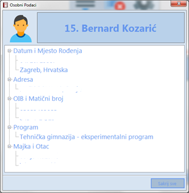

# 1. O aplikaciji

## 1.1. Opis aplikacije

• Ova aplikacija napravljena je sa namjerom da se isprave nedostaci
originalne stranice e-Dnevnik-a za učenike. Svrha aplikacije je
poboljšanje preglednosti i prikaza statistike vezane uz ocjene, sve na
jednome mjestu. Aplikacija sadrži mnogo naprednih funkcija koje su
objašnjene u ovoj dokumentaciji.

## 1.2. Ciljana publika

• Aplikacija može biti korisna i roditeljima i učenicima koji su
zainteresirani za statistiku ocjena i kako popraviti uspjeh, koje su
ocjene dobili u posljednje vrijeme, koji im je ukupan prosjek svih
predmeta i s kojim uspjehom će proći sudeći prema sadašnjim ocjenama,
ili pak po ocjenama koje je učenik sam izmijenio/dodao.

## 1.3. Tehnički zahtjevi

• Internetska veza

• .NET Framework 4.5

• OS: Windows XP/7/8/8.1/10

## 1.4. Izvedba

**Za izradu aplikacije korišteni su sljedeći alati:**

-   Visual Studio 2012 -- Visual C\#

-   Adobe Photoshop CC 2015 -- Splash Screen

Sve ikone u aplikaciji preuzete su sa stranice: *icons8.com* i
*iconarchive.com*

# 2. Uvod

## 2.1. Prijava u aplikaciju

• Nakon otvaranja aplikacije prikazuje nam se sljedeći prozor

• Ovdje upisujemo korisničko ime i lozinku koju koristimo za prijavu na
e-dnevnik za učenike.

• Nakon što smo upisali potrebne podatke, klikom na tipku za prijavu
prijavljujemo se u aplikaciju.

• Korisnik ima mogućnost spremanja lozinke, tako da sljedeći put kada se
želi prijaviti ne mora ponovno upisivati lozinku.

## 2.2 Odabir razreda

• U slučaju da je učenik pohađao više od jednog razreda u Aplikaciji
dobiva izbornik za izbor razreda:

• Korisnik ovdje odabire željeni razred, te nastavlja dalje s klikom na
tipku „Odaberi" ili tipkom Enter.

# 3. Opis sučelja

• Odmah nakon prijave, u gornjem lijevom
kutu možemo vidjeti neke osnovne informaciju o učeniku, razredu i školi
koju pohađa, te školsku godinu.

• Ispod toga nalazi se par tipki o kojima
ćemo malo kasnije.

• Ispod tih tipki nalazi se popis svih predmeta. Dvoklikom miša na
predmet otvara se predmet u e-dnevniku. Ispod popisa možemo vidjeti
profesora/icu koji predaje predmet koji smo označili, te konačno ukupan
broj predmeta.

• Na samome dnu, u lijevom kutu, nalazi se tipka za odjavu, kojom se
korisnik odjavljuje iz e-dnevnika, te ima mogućnost ponovne prijave ili
izlaza iz aplikacije.

• Sa desne strane nalazi se klasični e-dnevnik .

# 4. Osnovne značajke aplikacije

## 4.1. Prikazi svih predmeta odjednom

• Klikom miša na ovu tipku otvaraju se svi predmeti odjednom, što bi
inače morali raditi ručno predmet po predmet.

• Također korisnik može sakriti sve prikazane predmete ako to želi.

## 4.2. Trenutno brisanje bilješki u svrhu preglednosti

• Budući da je vrlo nepregledno čitati ocjene zajedno sa svim
bilješkama, tablica pisanih lektira te nadolazećih ispita, korisnik ima
mogućnost njihova skrivanja.

• Rezultat pritiska na tu tipku je sljedeći:

• U slučaju da korisnik želi vratiti izbrisane bilješke, to lako može
učiniti pritiskom miša na tu istu tipku.

## 4.3. Prikaz osobnih informacija

• Pritiskom miša na ovu tipku otvara nam se novi prozor u kojem možemo
naći osobne podatke u učeniku, kao što su adresa, datum rođenja, ime
majke i oca, OIB\...

• Ovdje imamu opciju prikaza svih podataka pritiskom miša na tipku
„Prikaži sve." Isto možemo i sakriti pritiskom miša na tipku „Sakrij
sve."

• U slučaju da korisnik želi prikazati pojedine podatke, to može
napraviti pritiskom na znak „plus" pokraj željenog podatka, te iste
sakriti pritiskom na „minuse"

# 5. Postavke

• Korisnik može podešavati neke postavke
aplikacije pritiskom na za to predviđenu tipku, nakon čega će mu se
otvoriti novi prozor s postavkama aplikacije.

## 5.1. Upravitelj ručno dodanih spremljenih ispita

• U slučaju da je korisnik [ručno dodao
ispite](#ispiti), ovdje ih može vidjeti, te njima upravljati.

• Postoji opcija brisanja svih ručno dodanih ispita, te samo onih
označenih.

## 5.2. Zadane postavke

• Ovdje korisnik može mijenjati zadane postavke, kao što su opseg
traženja nadolazećih ispita i nedavnih ocjena.

• Za primjenu željenih unesenih podataka
napravimo klik mišem na zelenu kvačicu pored podatka kojeg želimo
primijeniti. U slučaju da želimo primijeniti podatke za sve postavke
pritisnimo tipku miša na veliku zelenu kvačicu.

## 5.3. Upravitelj zapamćenih korisnika i lozinki 

• U prvoj kartici korisnik može upravljati
zapamćenim korisnicima i njihovim lozinkama.

• Može brisati zapamćene korisnike, dodavati nove, te mijenjati[^1]
lozinke postojećih korisnika.

• Za brisanje svih korisnika kliknite
lijevom tipkom miša na tipku u donjem lijevom kutu.

• Pritiskom miša na tipku odmah pored
tipke za brisanje svih korisnika, brišemo označene korisnike.

• Za dodavanje novog korisnika pritisnite
na tipku desno od tipke za brisanje označenih korisnika. Otvoriti će se
novi prozor u koje unosimo podatke za novog korisnika.

• Korisnik ne mora upisati lozinku u slučaju da želi da
samo korisničko ime ostane zapamćeno na računalu na kojem se
prijavljuje.

• Lozinka mora biti duža od 5 znakova.

• Za promjenu^1^ lozinke kliknite mišem na
tipku u desnom kutu.

• Otvoriti će se novi prozor u kojem unosimo potrebne podatke. Prvo
unosimo staru lozinku, a zatim novu. Nova lozinka mora biti dulja od 5
znakova te se mora razlikovati od stare lozinke.

# 6. Napredne funkcije aplikacije

## 6.1. Proizvoljno dodavanje i brisanje ocjena

• Korisnik ima mogućnost da proizvoljno dodaje i briše ocjene iz
željenih predmeta. Ova mogućnost nije dodana radi zloporabe, već zbog
kalkuliranja prosjeka u različitim slučajevima (*npr. Učenik je pisao
provjeru znanja i zanima ga koliki će mu biti prosjek ako iz te provjere
dobije pet, ili, ako učenik dobije negativnu ocjenu koju kasnije
ispravi, pa ga zanima prosjek ocjena bez te negativne ocjene, već samo
sa ocjenom koju je dobio nakon ispravka.*)

• Korisnik ovo može učiniti desnim klikom miša na ćeliju u koju želi
dodati ocjenu ili iz koje želi izbrisati ocjenu.

• Korisnik ovdje ima opciju dodavanja nove ocjene, jednostavno pritiskom
miša na željenu ocjenu.

• U slučaju da korisnik želi izbrisati ocjenu to može učinit pritiskom
miša na „*koš za smeće*"

• Korisnik također ima mogućnost zamjene
postojećih ocjena u ćeliji koju je odabrao nekom drugom ocjenom. To može
postići pritiskom miša na za to predviđenu tipku prije no što odabere
ocjenu.

**Napomena:** Ocjene koje su dodane od strane korisnika neće biti
ispisane koristeći funkciju „[*Ispis*](#ispis)", niti će se nalaziti na
popisu dobivenih ocjena, a nestaju osvježavanjem stranice.

## 6.2. Statistika ocjena, prosjeka i izostanaka, nedavne ocjene, nadolazeći ispiti

### 6.2.1. Zaključne ocjene

• Jedna od glavnih funkcija aplikacije
nalazi se u prozoru za statistiku kojim možemo pristupiti pritiskom na
sljedeću tipku:.

• Otvara se prozor sa mnoštvom funkcija.

• U ovom prozoru možemo vidjeti prosjeke, zaključne ocjene svih
predmeta, broj predmeta i ukupan prosjek. S desne strane vidimo broj
pojedinih zaključnih ocjena.

• U desnom donjem kutu nalaze se tipke za
ispis predmeta iz kojih imamo određenu zaključnu ocjenu te imamo
mogućnost da nam se u e-dnevniku prikažu ocjene iz tih predmeta.

• Ako želimo izmijeniti zaključne ocjene u svrhu
provjere općeg uspjeha s nekom određenom zaključnom ocjenom to možemo
napraviti duplim klikom miša na željeni predmet.

### 6.2.2. Ocjene (sve ocjene i nedavne ocjene)

• Na sljedećoj kartici „Ocjene" možemo naći dva izbora, a to su: „Sve
ocjene" i „Nedavne ocjene."

• Pod „Sve ocjene" možemo vidjeti ocjene iz svih predmeta, a sa strane
nam je prikazana osnovna statistika, poput broja određenih ocjena,
postotka neke ocjene te ukupan broj ocjena.

• Također istu to statistiku možemo vidjet
duplim klikom miša na željeni predmet.

• Osim toga možemo vidjeti i profesora/icu koji predaje taj predmet,
prosjek i zaključnu ocjenu.

• U odabiru „Nedavne ocjene" možemo vidjeti ocjene koje smo dobili u
zadnjih nekoliko dana. Korisnik sam može upisati koliko će to dana biti.

### 6.2.3. Ispiti

• Na kartici „Ispiti" nalaze se nadolazeći ispiti. Isto kao i pod
nedavnim ocjenama i kod nadolazećih ispita možemo odrediti za koliko
dana unaprijed želimo vidjeti ispite.

• Ukoliko iz nekog predmeta nije upisana provjera znanja učenik ju sam
može dodati kao podsjetnik. To može učinit pritiskom na tipki „Dodaj
novi ispit \..." Ovi ispiti su spremljeni lokalno na računalo i mogu se
obrisati u postavkama. Svaki korisnik može dodavati svoje ispite.

### 6.2.4. Izostanci

• U kartici „Izostanci" možemo vidjeti koliko
pojedinih izostanaka učenik ima. Razlike od originalnog e-dnevnika su
dvije:

• Prva je da možemo vidjeti postotak pojedinih izostanaka.

• Druga je ukupan zbroj svih izostanaka u koji ulaze i „Ostali
izostanci."

### 6.2.5. Dodatne informacije

• Na posljednjoj kartici „Dodatne informacije" korisnik može vidjeti
koliki zbroj zaključnih ocjena mu je potreban za željeni opći uspjeh.

• Ovdje se nalazi i „zaključak" koji je generiran od strane aplikacije
na temelju izračunate statistike. U njemu piše koji nam je ukupan
prosjek, opći uspjeh, te koliko se moramo popraviti da nam opći uspjeh
bude još bolji.

## 6.2. Ispis

• Posljednja, ali i jedna od najboljih
funkcija aplikacije je ispis gotovo sve statistike koju nudi ova
aplikacija u .HTML datoteci, koja se kasnije može ispisati na papir.

• Ispis je vrlo pregledan te sadrži mnoštvo informacija.

• Ispisu pristupamo pritiskom na sljedeću tipku:

• Otvorit će nam se prozor gdje odabiremo podatke koje želimo da se
ispišu.

• Kada smo označili željene stavke,
stisnemo tipku „Ispis \..."

• Otvoriti će se tipični dijalog za spremanje datoteke.

• Odaberemo željeni naziv i mjesto gdje želite pohraniti datoteku, te
završite ispis pritiskom na tipku „Save" -- hrv. „Spremi"

• Nakon što smo spremili datoteku dobiti ćemo ponudu da je otvorimo.

• U slučaju da je otvorimo, datoteka će se otvoriti u zadanom web
pregledniku.

[^1]: Promjena lozinke je lokalna, te vrijedi samo za računalo na kojem
    se korisnik prijavljuje. Lozinka vašeg računa ostaje nepromijenjena.
